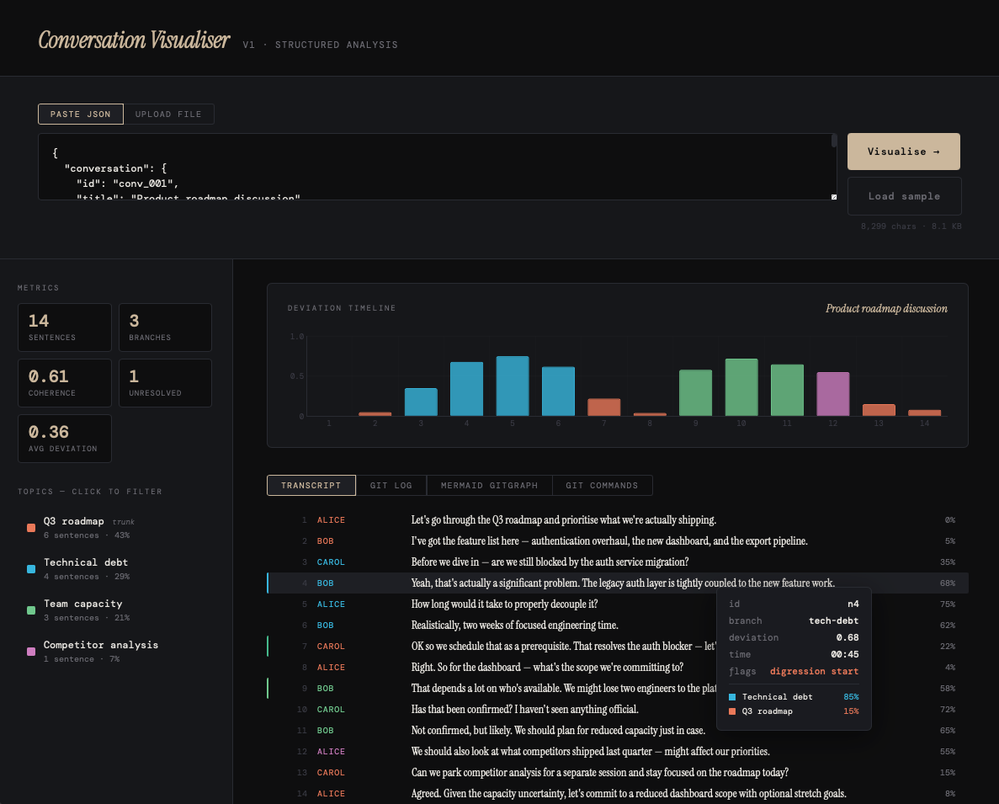
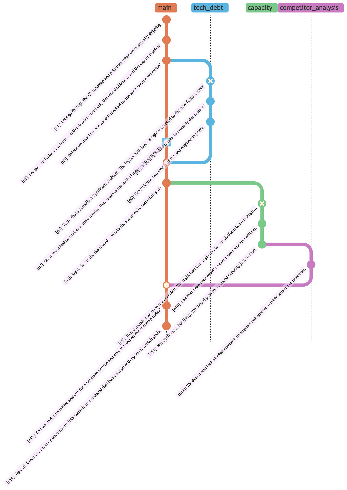
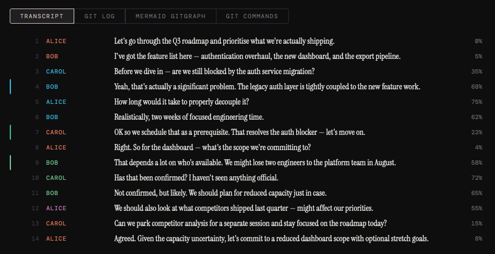
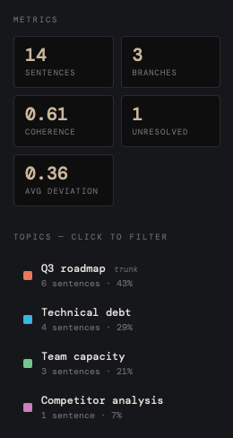
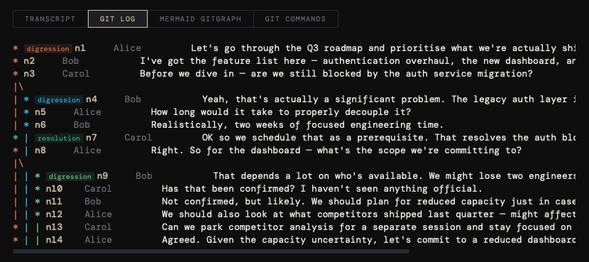

# 🗺️ Conversation Cartography

> 🤖 *Vibe coded with AI assistance*

## TL;DR

Conversation Cartography is a proof-of-concept tool that represents the structure of a conversation as a **directed graph** — modelled after a Git branch diagram. Each conversation is rendered as a main trunk, with branches for sub-topics, tangents, and diverging threads. A branch that reaches a genuine conclusion merges back. A branch that trails off remains open.

The result is a kind of **cognitive fingerprint** — a structural map of how a speaker's mind moves through a topic, and whether they resolve what they raise.


*The main application interface: sentence-by-sentence transcript, categorised by percentage of topic and per-speaker clarity metrics on the right. Topics are colour-coded; open (unresolved) branches are visually distinct from merged ones.*

## How to Use

This is a two-step process: **generate the JSON** using Google AI Studio, then **load it into the visualiser**.

### Step 1 — Generate the JSON in Google AI Studio

1. Go to [aistudio.google.com](https://aistudio.google.com) and start a new prompt
2. Enable **Structured Output**: `prompt/structured-output_v1.json`
3. Set **System instructions** with the prompt: `prompt/system-prompt_v1.md`
4. Paste your conversation transcript into the user message
5. Run the prompt and the model will return a JSON object
6. Copy the raw JSON output and save it as a `.json` file

### Step 2 — Visualise in the tool

1. Open `index.html` in any modern browser (no server needed — it runs entirely client-side)
2. Click **Load JSON** and select the file you saved in Step 1
3. Switch between the four views using the tabs: **Transcript**, **Git Log**, **Git Tree**, and **Git Commands**

## Origin & Motivation

The idea began during the 2016 U.S. presidential debates. Watching two candidates exchange words for 90 minutes, it became clear that the *structure* of what they were saying — not just the content — was carrying a great deal of signal. One candidate would raise a point, pivot mid-sentence, introduce a tangent, and never return. The other might deflect entirely, substituting rhetorical flair for logical resolution.

The question that crystallised: **can we measure clarity of mind from the shape of a conversation?**

Not from sentiment, not from keyword frequency, but from the *topology* of the discourse itself — whether threads get picked up and resolved, or simply left dangling.


_**The Tree View** is the closest analogue to a standard Git branch diagram. Branches diverge, run in parallel, and either merge back (resolved topics) or terminate open (abandoned tangents). The visual asymmetry between a speaker who resolves and one who doesn't is immediately apparent._

## The Analytical Framework

Clarity of mind, in this model, is not a single dimension but three independent and measurable ones:

| Dimension | Scientific Question | Graph Signal |
|---|---|---|
| **Logical Completeness** | Does the speaker resolve the arguments they raise? | Ratio of open to merged branches |
| **Topical Coherence** | Does the speaker stay on topic, or drift continuously? | Depth of branch nesting; frequency of new branches |
| **Rhetorical Effectiveness** | Does the speaker actually answer the question posed? | Branch origin relative to the question node |

These dimensions are deliberately independent. A skilled communicator might score low on completeness (many open branches) while scoring high on rhetorical effectiveness — they redirect without resolving. This orthogonality is a feature, not a bug: it allows for nuanced, multi-axis speaker profiles rather than a single opaque "clarity score."

## How the Model Works

### Branching Rules

The core logic rests on three branching rules, applied sequentially to each utterance in the transcript:

| Rule | Name | Condition | Graph Action |
|---|---|---|---|
| 1 | **Natural Closure** | A topic reaches a genuine conclusion | Branch merges back to parent |
| 2 | **Topic Resumption** | Conversation returns to a previously opened topic | Checkout that branch; continue commits from that point |
| 3 | **Abandoned Tangent** | A topic trails off with no resolution and is never revisited | Branch remains open — no merge |

Rule 3 is the primary signal for the completeness dimension: the more dangling open branches at the end of a transcript, the lower the speaker's logical resolution score.

### Strictness Parameter

A configurable **strictness threshold** controls the granularity of branching — how semantically distinct a new utterance must be before it warrants its own branch. In strict mode, sub-topics branch from their immediate parent, producing deep hierarchies. In loose mode, tangents are attached directly to the nearest major topic, producing flatter, broader structures.

This threshold maps to a semantic distance parameter in the underlying LLM prompt — or to a cosine similarity cutoff if using embedding-based segmentation.

### Data Pipeline

The system is deliberately layered so that a single structured JSON representation can serve multiple visualisation consumers:

```
Transcript (text or audio)
        ↓
  LLM Analysis
  (topic detection, branch events, closures, resumptions)
        ↓
  JSON — Source of Truth
  (branches, nodes, branch events with full metadata)
        ↓
  ┌─────────────────────────────────────────┐
  │  Mermaid GitGraph  │  Score Dashboard  │ ...
  └─────────────────────────────────────────┘
```

The JSON schema defines three core entity types:

- **Branch** — `id`, `parent_id`, `topic_label`, `status` (active / suspended / closed), `opened_at`, `closed_at`
- **Node** — `id`, `speaker`, `text`, `branch_id`, `type` (statement / question / answer / tangent / closing)
- **BranchEvent** — `type` (open / suspend / resume / close), `from_branch_id`, `to_branch_id`, `at_node_id`, `trigger`

## Screenshots

### Transcript View

*The annotated transcript view, where each sentence is tagged with its assigned topic branch. Colour coding corresponds to branch depth and speaker, making it possible to visually trace topical drift through the conversation.*

### Sidebar Metrics

*The metrics sidebar displaying per-speaker statistics derived from the branch graph — including branch counts, open (unresolved) branches, and a breakdown across the three clarity dimensions.*


*A Git-log-style ASCII representation of the conversation structure. Each commit corresponds to a sentence or utterance; branch names reflect identified topics. This view makes the parallel to version control explicit.*

## Technology

- **Backend analysis:** Google AI Studio (Gemini) with structured output, used for topic identification, branch event detection, and label generation
- **Frontend:** Single-file HTML/JavaScript application with four switchable views (transcript, Git log, Mermaid GitGraph, Git command generator)
- **Visualisation:** Mermaid.js for GitGraph diagrams; custom ASCII renderer for the log view
- **No framework dependencies** — intentionally minimal for portability

## Key Learnings

**Branch resumption is an unsolved problem in NLP tooling.** Existing topic segmentation tools (TextTiling, LCseg, SECTOR) handle *new topic detection* reasonably well, but none address the case where a speaker *returns* to a prior topic. This is the analytically interesting case, and it requires holding the full prior branch context in mind — which is precisely what LLMs are suited for.

**LLMs outperform specialised models for this task.** Branch closure and resumption detection require genuine reasoning about semantic intent, not just surface pattern recognition. Zero-shot LLM prompting outperformed purpose-built dialogue segmentation tools for these subtler events, at the cost of latency and API spend.

**The Git metaphor is more than aesthetic.** Treating conversation structure as a commit graph enforces useful constraints: every utterance must belong to exactly one branch; branches must have a parent; merge events must reference an existing branch. These constraints surface ambiguity in the transcript that looser models would silently absorb.

**Multi-topic sentence assignment adds value but adds complexity.** Real utterances often straddle topics. Allowing weighted multi-topic assignment produces richer data but complicates downstream branch logic significantly.

**Separating the data model from the visualisation is essential.** Early versions coupled JSON generation tightly to Mermaid output. Refactoring to treat the JSON as the source of truth — with multiple independent renderers — unlocked the ability to add new views without touching the analysis layer.

## Future Improvements

- **Hybrid NLP pipeline** — use lightweight unsupervised segmentation (TextTiling or LCseg) as a pre-processing step to detect branch-open events cheaply, reserving LLM calls for closure and resumption detection only. This would reduce cost and latency substantially.

- **Inter-annotator agreement study** — manually annotate 3–5 transcripts at different strictness levels with multiple human raters to empirically define the parameter space and validate the model's branch events against human judgement.

- **Formalised clarity scores** — translate branch graph metrics into explicit, interpretable scores for each of the three clarity dimensions, with confidence intervals derived from the strictness parameter sweep.

- **Audio pipeline** — extend input handling to accept audio files directly, with automatic transcription and speaker diarisation as a pre-processing stage.

- **Temporal dynamics** — extend the model to track how clarity metrics evolve *within* a single conversation, not just as aggregate end-states. A speaker who starts scattered and converges is meaningfully different from one who starts clear and loses the thread.

- **Multi-party conversation support** — the current model handles dialogue but treats speakers somewhat symmetrically. A richer model would track inter-speaker branch *influence*: when Speaker B causes Speaker A to abandon their open thread.
